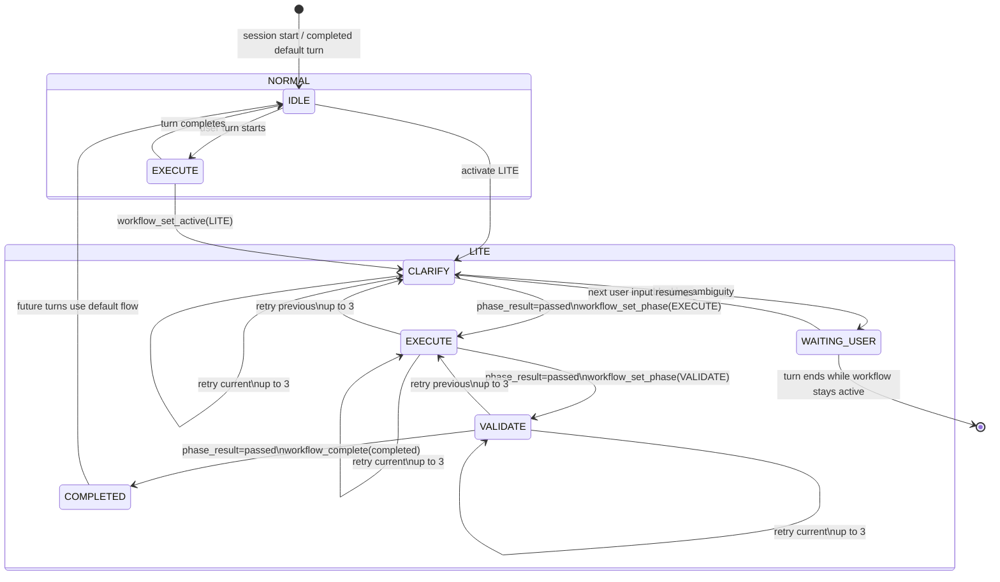

# Engine Runtime

This document explains how Themion's core harness/runtime works: how prompt inputs are assembled, how context is built, how tool calls are executed, how workflow state progresses, and how session history is stored.

## Scope

Most of the logic described here lives in `crates/themion-core/`. The CLI crate (`crates/themion-cli/`) is responsible for starting sessions, wiring the TUI, loading config, and passing the active project/session context into the core runtime.

Relevant areas:

- `crates/themion-core/src/agent.rs`
- `crates/themion-core/src/client.rs`
- `crates/themion-core/src/client_codex.rs`
- `crates/themion-core/src/tools.rs`
- `crates/themion-core/src/db.rs`
- `crates/themion-core/src/workflow.rs`
- `crates/themion-cli/src/` for session startup and UI integration

## High-level flow

A single user turn follows this shape:

1. The CLI starts or resumes a harness session.
2. The user submits input.
3. The harness records a new turn and persists the user message.
4. The harness builds the model input from:
   - the base system prompt
   - predefined built-in coding guardrails
   - predefined Codex CLI web-search instruction
- injected contextual instructions such as `AGENTS.md`
   - workflow context and phase instructions
   - an optional history recall hint
   - the recent conversation window
5. The active backend streams the assistant response.
6. If the model requests tools, the harness executes them and appends tool results to the conversation.
7. The harness calls the model again with the updated conversation.
8. Workflow tools may also inspect or mutate the current workflow state between model calls.
9. This repeats until the model returns a normal assistant response with no more tool calls, or the loop limit is reached.
10. The turn is finalized in SQLite with message, workflow, and token metadata.

## Prompt inputs

Themion keeps different instruction sources separate instead of flattening them into one blob.

### 1. Base system prompt

The base system prompt comes from configuration. It establishes the assistant's default behavior and is always part of the prompt sent to the model.

This is the top-level instruction layer.

### 2. Predefined coding guardrails

Themion injects a short built-in coding-guardrail instruction layer after the base system prompt and before repository-local instructions. This layer is inspired by the commonly shared “Karpathy's `CLAUDE.md`” idea set, but Themion adopts only a minimal behavioral subset rather than Anthropic's full Claude Code mechanism.

The built-in topics are:

- avoid making important assumptions silently
- prefer the simplest solution that cleanly solves the task
- make targeted changes and avoid unrelated refactors
- run the narrowest useful validation and report the result

This layer remains separate from both the base system prompt and repository-local instruction files.

### 3. Predefined Codex CLI web-search instruction

Themion injects a short built-in instruction layer telling the agent to use Codex CLI via the shell as the preferred path for web-search-style research when the task requires current external information that is not available in the local repository.

This layer is separate from both the predefined coding guardrails and repository-local instructions. It is intentionally narrow: it guides the model toward Codex CLI for focused external research, not arbitrary external-tool delegation.

The instruction also tells the model to report clearly when Codex CLI is unavailable or fails, rather than pretending certainty about external facts.

### 4. Contextual instruction files

Repository or workspace instructions such as `AGENTS.md` are treated as separate injected prompt inputs, not as text concatenated into the base system prompt.

That separation matters because:

- it preserves the distinction between global assistant behavior and repository-local instructions
- it matches the repository's prompt assembly expectations
- it keeps compatibility with both chat-completions-style backends and the Codex Responses backend

In practice, the model sees both the base system prompt and the injected contextual instructions, but they remain separate prompt components.

### 5. Workflow context and phase instructions

Workflow runtime state is injected as another separate prompt component.

The runtime includes a compact workflow summary such as:

- active workflow name
- current phase
- workflow status
- current phase result
- activation source
- allowed next phases
- retry counters and limits
- phase entry kind

For example, the engine injects a line in this shape:

> Workflow context: flow=LITE phase=CLARIFY status=running phase_result=pending agent=main activation_source=user_input allowed_next=EXECUTE retry_current=0/3 retry_previous=0/3 entered_via=normal

The runtime also injects phase-specific guidance from `workflow.rs`. For the built-in `LITE` workflow:

- `CLARIFY` tells the model to produce a compact brief, state assumptions, and ask only when ambiguity is genuinely blocking
- `EXECUTE` tells the model to implement the smallest working slice and keep scope narrow
- `VALIDATE` tells the model to check success criteria and return pass or fail

### 6. Recall hint for trimmed history

When the in-memory conversation is longer than the configured context window, the harness adds a synthetic system message explaining that earlier turns are still available in persistent history.

Example shape:

> Note: N earlier turn(s) (seq 1–N) are stored in history. Use `history_recall` to load a range or `history_search` to find a keyword.

This gives the model a way to recover older context without sending the full conversation every time.

## Context building

The harness keeps the full conversation in memory, but only sends a bounded recent window to the model.

### Full in-memory history

`Agent` owns a complete `Vec<Message>` for the active session. Messages are not trimmed out of memory during the session.

This full history includes:

- user messages
- assistant messages
- tool results

### Windowed model context

For each model request, the harness constructs a smaller prompt window. Conceptually it looks like this:

```text
[system prompt]
[predefined coding guardrails]
[predefined Codex CLI web-search instruction]
[injected contextual instructions, e.g. AGENTS.md]
[workflow context + phase instructions]
[recall hint, if older turns were omitted]
[recent turns only]
```

`Agent.window_turns` controls how many recent turns are included. Older turns remain in memory and in SQLite, but are not sent unless recovered through history tools.

This design gives a few benefits:

- lower token usage on long sessions
- stable prompt size
- recoverability of old context through explicit tool use

## Workflow runtime

Themion has explicit workflow and phase runtime state, separate from plain conversational history.

### Built-in workflows

The current built-in workflows are:

- `NORMAL`
  - start phase: `EXECUTE`
  - used for the default one-turn direct execution path
- `LITE`
  - start phase: `CLARIFY`
  - uses a compressed `CLARIFY -> EXECUTE -> VALIDATE` flow with retry-aware recovery

Sessions still default to `NORMAL`, and the runtime may return to `NORMAL` / `IDLE` behavior after a workflow completes.

### Workflow state shape

The runtime tracks state including:

- workflow name
- phase name
- workflow status: `running`, `waiting_user`, `completed`, `failed`, or `interrupted`
- phase result: `pending`, `passed`, or `failed`
- agent label
- last updated turn sequence
- retry state
  - current-phase retries and limit
  - previous-phase retries and limit
  - how the phase was entered: `normal`, `retry_current_phase`, or `retry_previous_phase`

### Workflow control tools

Workflow state is model-visible through dedicated tools:

- `workflow_get_state`
- `workflow_set_active`
- `workflow_set_phase`
- `workflow_set_phase_result`
- `workflow_complete`

Important runtime rules:

- `workflow_set_active` always resets the phase to that workflow's start phase
- `workflow_set_phase` is validated against the active workflow's allowed transitions
- `workflow_set_phase` requires the current `phase_result` to be `passed`
- `workflow_complete` with outcome `completed` also requires current `phase_result=passed`
- runtime validation stays authoritative even when the model requests a change

`workflow_get_state` returns not only workflow and phase, but also retry information, previous phase info, phase instructions, and allowed next phases.

## Workflow state diagram

The built-in workflow graph is small enough to document directly.



### Diagram notes

- `NORMAL` is the default runtime path. In practice it moves into `EXECUTE` for active work and back to idle when the turn ends.
- Activating `LITE` always enters `CLARIFY`; phase names do not carry across workflow switches.
- `waiting_user` is a workflow status pause, not a normal phase in the `LITE` sequence.
- The model must set `workflow_set_phase_result(result="passed")` before a valid `workflow_set_phase(...)` or successful `workflow_complete(outcome="completed")`.
- Retry behavior is bounded separately for current-phase and previous-phase recovery, each with a limit of `3`.
- On retry exhaustion, the runtime marks the workflow failed rather than looping indefinitely.

## Harness loop behavior

Each `run_loop(user_input)` call handles one user-submitted turn, including any tool round-trips triggered during that turn.

### Step-by-step

1. Record a turn boundary in memory.
2. Open a new turn row in SQLite.
3. Detect any workflow activation marker such as `workflow:lite` before normal processing.
4. Append the user message to the in-memory conversation.
5. Persist the user message to the database.
6. Build the current model context window.
7. Call the active `ChatBackend` with:
   - model name
   - prompt messages
   - tool definitions
   - streaming callback
8. Stream assistant text chunks to the UI while accumulating the full assistant response.
9. Persist the assistant response.
10. If there are no tool calls, evaluate the workflow state:
    - a normal phase may complete
    - the workflow may auto-advance
    - the workflow may pause in `waiting_user`
    - the workflow may complete or fail
11. If there are tool calls:
    - execute each requested tool
    - append tool results as `role="tool"` messages
    - persist those results
    - update workflow state if a workflow-control tool was used
    - call the model again with the updated conversation
12. Repeat until no more tool calls are returned, up to the hardcoded loop limit.
13. Finalize the turn with workflow summary and token statistics.

Themion currently caps this inner tool loop at 10 iterations per turn.

## Runtime status events

In addition to assistant text, tool-call rows, and final turn statistics, the harness emits explicit informational status events for a few runtime boundaries that are useful to see in the normal event stream.

Current status-event coverage includes:

- turn start
- workflow transition
- workflow phase transition
- workflow phase-result update

These are emitted by `themion-core` as structured `AgentEvent` values and rendered by the TUI as softer, neutral inline status rows rather than green success markers. Their purpose is to narrate state changes without implying that the workflow has completed successfully.

Typical event text is compact, for example:

- `turn 12 started`
- `workflow changed: NORMAL -> LITE`
- `phase changed: EXECUTE -> VALIDATE`
- `phase result updated: pending -> passed`

This event stream complements, rather than replaces, the statusline and persisted workflow state. The statusline shows current state; status events show when the state changed during the turn.

## Tool calling

Themion uses OpenAI-style tool calling.

### Tool definitions

On each model request, the harness sends a JSON-schema-style description of the available tools. This happens through `tool_definitions()` in `tools.rs`.

### Tool execution

When the model returns tool calls, the harness dispatches them through `call_tool(name, args, &ToolCtx)`.

Available canonical tools include:

- `fs_read_file`
- `fs_write_file`
- `fs_list_directory`
- `shell_run_command`
- `history_recall`
- `history_search`
- `workflow_get_state`
- `workflow_set_active`
- `workflow_set_phase`
- `workflow_set_phase_result`
- `workflow_complete`

Deprecated aliases for the older short names are still accepted internally during the transition period, but only the domain-prefixed names are exposed in tool definitions.

### Tool context

Each tool call receives a `ToolCtx` containing:

- database handle
- session ID
- project directory
- workflow state
- current turn sequence

Filesystem tools mostly ignore this context. History tools use it to query session-aware SQLite data. Workflow tools use it to inspect or update runtime workflow state.

### Tool result handling

Tool output is inserted back into the conversation as a tool message. The model then sees the result and can:

- answer the user directly
- request another tool
- recover older context from history
- inspect or change workflow runtime state
- revise its prior plan based on tool output

If a tool fails, the runtime returns an error string as the tool result rather than crashing the loop. That lets the model observe the failure and decide what to do next.

## Streaming and backend abstraction

Themion keeps provider-specific transport logic behind a shared backend abstraction.

### `ChatBackend`

The harness talks to a `ChatBackend` trait rather than directly to a provider-specific client. This keeps the core loop reusable while allowing different wire formats.

### Chat Completions backends

Providers such as OpenRouter and local OpenAI-compatible servers use a chat-completions-style streaming API. The client parses `data:` SSE frames and forwards token deltas to the harness.

### Codex Responses backend

Codex uses the OpenAI Responses API with named SSE events. It has separate request/response translation and streaming parsing, but the harness loop above it stays the same.

This separation is important: provider-specific behavior lives in backend modules instead of being spread across ad hoc conditionals in the core loop.

## Session and history storage

Themion stores persistent history in SQLite so older context can be recalled across long sessions.

### Database location

History is stored at:

- `$XDG_DATA_HOME/themion/system.db`
- typically `~/.local/share/themion/system.db`

### Main tables

The database includes:

- `agent_sessions`
  - one row per started session
  - includes session identity, project directory, and current workflow runtime state
- `agent_turns`
  - one row per user turn
  - includes turn sequence, workflow summary, and token metadata
- `agent_messages`
  - one row per message within a turn
  - stores role, content, tool-call metadata, and workflow annotations when available
- `agent_workflow_transitions`
  - transition log for workflow and retry state changes
- `agent_messages_fts`
  - full-text search index for message content

### Session model

Each process start creates a new `session_id`. Multiple sessions can coexist in the same database file.

This allows:

- persistent history across runs
- session-scoped recall
- full-text search over past messages
- reconstruction of current workflow state
- future support for multiple concurrent agents

## Why history tools exist

The model does not automatically receive the full archived conversation. Instead, older messages are discoverable through tools.

This has two effects:

- normal requests stay smaller and cheaper
- the model can explicitly fetch older context only when needed

The two history tools serve different jobs:

- `history_recall` loads known earlier turns or message ranges
- `history_search` finds relevant older content by keyword or text match

Together with the recall hint, these tools form the bridge between a bounded context window and long-lived session memory.

## Relationship to the CLI/TUI

The CLI crate is not the harness loop itself, but it drives the loop.

It is responsible for:

- loading config
- resolving project directory
- opening the database handle
- creating session IDs
- running the TUI or print mode
- rendering streaming `AgentEvent` output
- showing workflow and phase state in the statusline
- rendering softer inline harness status events for turn starts and workflow-state transitions

The core crate is responsible for:

- message history management
- prompt/context assembly
- workflow state and retry logic
- provider calls
- tool execution
- database persistence logic

## Practical mental model

A useful way to think about Themion's engine/runtime is:

- **system prompt** defines default assistant behavior
- **predefined coding guardrails** add a built-in coding baseline before repository-local instructions
- **predefined Codex CLI web-search instruction** points the agent to Codex CLI for focused external research when local information is insufficient
- **`AGENTS.md` and related instructions** define repository-local behavior
- **workflow context** tells the model what state machine it is currently operating inside
- **recent turns** provide immediate conversational context
- **history tools** recover older context on demand
- **workflow tools** let the model inspect and control workflow runtime state
- **tool calls** let the model inspect and change the workspace
- **SQLite** preserves both long-term conversation memory and workflow progression state

That combination gives Themion a bounded live context with explicit access to deeper session memory and explicit workflow-aware execution semantics.
